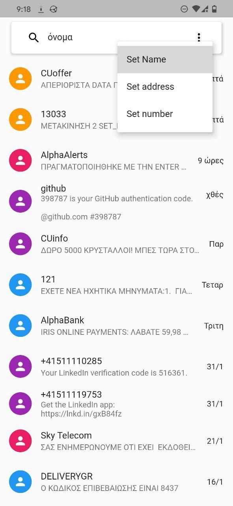
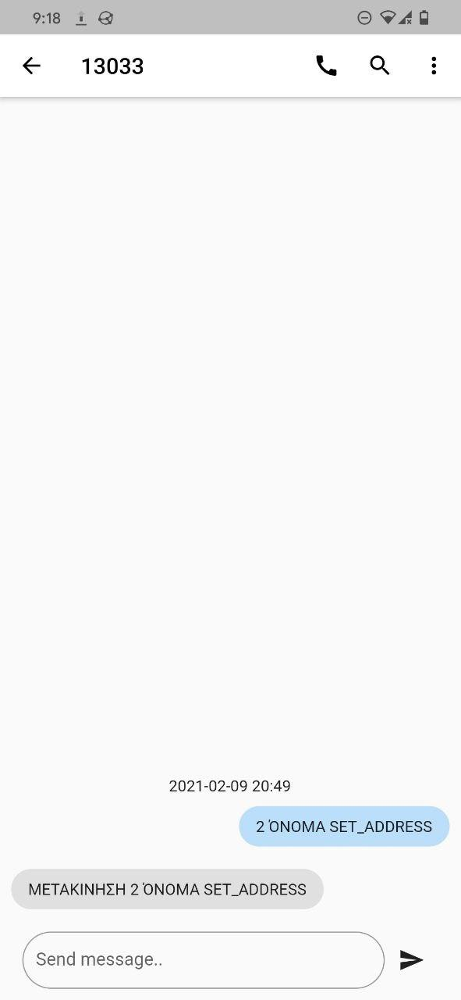

# kSMS - 13033

**k stands for Koulis**

Saves your name, address and the last code [1-6] you set, so every time you open the
app it seems that you send a message to 13033 20-40 minutes ago.

## How to use

- Write your name in the searchbar
- Tap the more icon on the right and select **Set Name**
- repeat for the rest of your info

## Screenshots

