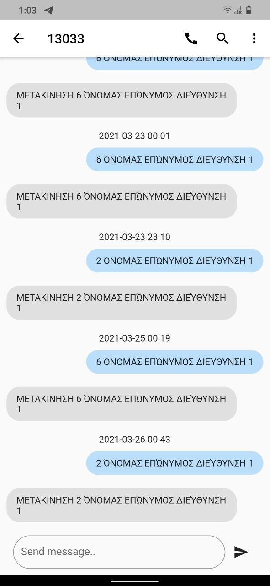
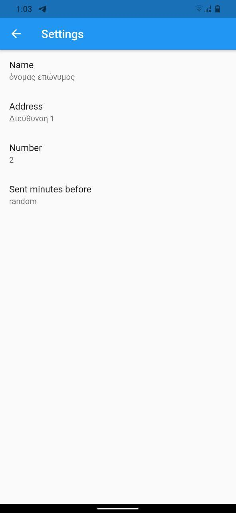
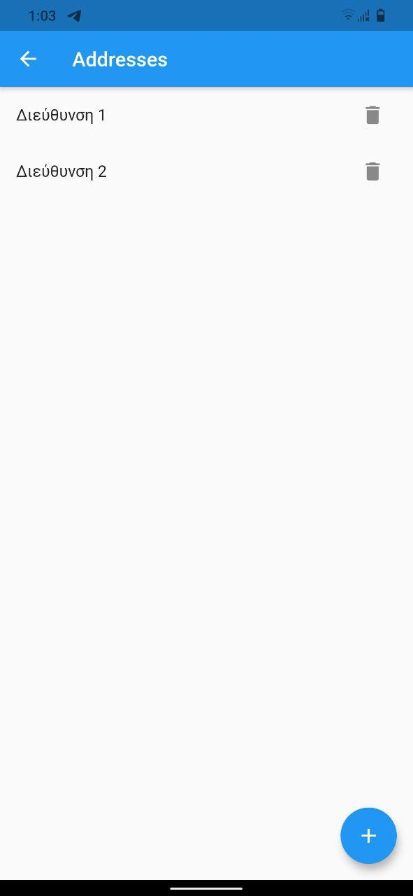

# kSMS - 13033

**k stands for Koulis**

Saves your name, address and the last code [1-6] you setted, so every time you open the
app it seems that you have sent a message to 13033 20-40 minutes ago.

## How to use

- Tap the more icon on the right and go to **Settings**
- Set everything up just one time, and you are ready to go

## Download
Get the latest release for your device [here](https://github.com/johnstef99/kSMS/releases).
If you are not sure what to download try the _arm64-v8a_ version

## Screenshots

